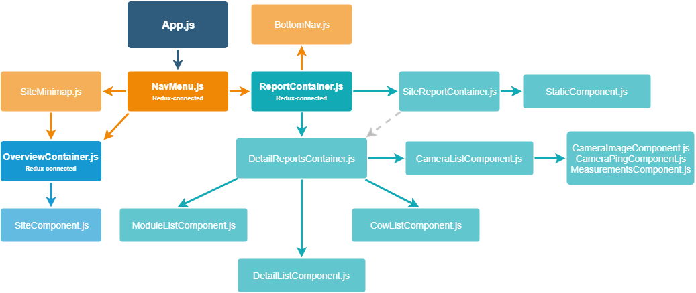

# Agricam front-end

Agricam front-end status dashboard interface built with `React`/`redux`.

Before delving into the code you should have at least rudimentary knowledge of
both `React` and `redux`.

For learning `React`, the
[documentation](https://reactjs.org/docs/hello-world.html) is very well-written
and straight to the point.

`redux` is more advanced and relies on your knowledge of both React and JavaScript
in general. Again, the [documentation](https://redux.js.org/) is very good but
in addition to that there is an
[excellent video course on redux](https://egghead.io/courses/getting-started-with-redux)
and why it is needed in the first place, taught by the creator of `redux` himself, Dan Abramov.

## Table of Contents

* [Installing and running the project](#installing-and-running-the-project)
* [Packages](#packages)
* [Project structure](#project-structure)
* [State management](#state-management)
* [Styling](#styling)
* [Translation](#translation)

## Installing and running the project

The pre-requisites for the project are:

* [node.js](https://nodejs.org/en/)
* [yarn](https://yarnpkg.com/en/docs/install) for package management
* [serve](https://www.npmjs.com/package/serve) for hosting the production build
  (globally installed with `yarn global add serve`)
* [i18next](https://www.i18next.com/) for
  translation work (globally installed with `yarn add i18next`).

To install all packages used in the project first run `yarn install` in the root
directory.

To run the project in a production environment, run the `yarn build` command followed by the
`serve -s build` command in the root directory to start the static server.

To run the project in a development environment, run the `yarn start` command in the root directory to start the
development server.

The `build` and `start` scripts are originally from `create-react-app` and can
be found in `./scripts`.

## Packages

All installed packages and their current versions can be found in
`./package.json`. To add or remove packages use `yarn add/remove package-name`
and to upgrade existing packages use `yarn upgrade package-name@version` where
`version` is the desired new version. Additional options are available in the
[docs for yarn](https://yarnpkg.com/en/docs/).

### [babel](https://babeljs.io/)

`babel` is a JavaScript compiler that takes the project code, written in syntax
that might not be available in all target browsers, and transpiles it down to
syntax that _is_ available. The project code is mostly written in ES2015-18 syntax
with things like [arrow functions](https://babeljs.io/docs/plugins/transform-es2015-arrow-functions/), [object destructuring](https://babeljs.io/docs/plugins/transform-es2015-destructuring/), [exponentiation operator](https://babeljs.io/docs/en/babel-plugin-transform-exponentiation-operator) and [spread operator](https://babeljs.io/docs/en/babel-plugin-proposal-object-rest-spread).


### [ESLint](https://eslint.org/) and [prettier-eslint](https://github.com/prettier/prettier-eslint)

`ESLint` is a linting utility which is used in conjunction with `prettier-eslint`, a code formatter, to ensure consistent code style
across the whole project. Using a code editor like Visual Studio Code with the
`ESLint` and `Prettier` extensions is recommended to see warnings and errors in-line, and to format on save.

### [Jest](https://facebook.github.io/jest/)

`Jest` is a testing framework that is currently not being used in the project
but is most likely the package you would want to use when/if unit tests are
going to be implemented.

### [i18next](https://www.i18next.com/)

`i18next` is used for all the translations in the project. See [translation](#translation) for detailed instructions on how to use it.

### [Material-UI](http://www.material-ui.com/#/)

`material-ui` is a material design component library used for a consistent application appearance.

### [moment](https://momentjs.com/)

`moment` is the library used to display and manipulate times and dates.

### [React Router](https://reacttraining.com/react-router/), [history](https://github.com/ReactTraining/history) and [connected-react-router](https://github.com/supasate/connected-react-router/)

`React Router` is used for basic routing between the different pages of the project and `history` is used for web browser history integration. `connected-react-router` integrates `React Router` with `redux`.


### [redux](https://github.com/reactjs/redux), [react-redux](https://github.com/reactjs/react-redux), [redux-thunk](https://github.com/gaearon/redux-thunk) and [redux-persist](https://github.com/rt2zz/redux-persist)

`redux` and `React redux` is the state management library used in the project and `redux-thunk` is used to enable asynchronous actions (fetching data from the api) and dispatching multiple actions at the same time. Additionally `redux-persist` is used to save `redux` state (the user's chosen language) in browser storage. See [state management](#state-management) for more detailed information.

### [webpack](https://github.com/webpack/webpack)

`webpack` is the code bundler used to take all the modules and code written and bundle it into one file, aptly called `bundle.js`. This is then sent to the browser and used to run the application.

### Other

All remaining packages not mentioned (or inherently related to the packages above) should be `create-react-app` related
in some way and their use is most likely in either `./scripts` or `./config`.

## Project structure

This section will give you an overview of all the files and folders available
and their purpose in the project.

The project was bootstrapped with
[create-react-app](https://github.com/facebookincubator/create-react-app) and
later "ejected" to enable further customization. Their documentation is very
thorough and will most likely answer any further questions you might have
regarding the basic project structure.
____________________
`./config` contains all config files that dictate how the applications runs, mostly `webpack` (code bundling) related. These files are all from `create-react-app` and should as such not be necessary to change at all. If problems occur here then submitting an issue on `create-react-app`'s GitHub would be a good idea.

`./config/webpack.config.dev.js` determines how the `webpack` bundles the code in a development environment and `./config/webpack.config.prod.js` does the same but for production environment.

`./config/webpackDevServer.config.js` contains the configuration for the development server that runs when the `yarn start` command is issued.
____________________
`./public` contains the base `index.html` file which only needs to have a `div` with the `id="root"` attribute for `React` to function properly.

`./scripts` contains the `build` and `start` scripts that `create-react-app` came with. It also contains a `test` script that would be used if unit testing was going to be implemented.

`./.eslintrc` and `./.eslintignore` are the configuration files for `ESLint`.

`./package.json` contains all the dependencies of the project and it is this file that is used to install everything needed to run the project when the `yarn install` command is issued. This file also specifies what `yarn start/build` does (calls the corresponding script in `./scripts`). Any required `babel` plug-ins or presets are also specified in this file, along with the configuration for `Babel` and `Jest`.

`./yarn.lock` is an automatically generated file that yarn uses to lock down package versions.

`./src` is where the actual Agricam application lives.

`./src/assets` contains all static assets in use by the application, like images or data files.
____________________
`./src/components` contains all `React` components which have one folder and `.js` file each. Components are either written as class components if they need to utilize their own state in some way, otherwise they are written as functional components.

`./src/components/App.js` is the main entry for the `React` component tree, which also contains all the `React Router` routes available in the application.

`./src/components/Helpers` contains smaller helper functions which are used in other components. 

`./src/components/NavMenu` contains all navigational components such as the `NavMenu`, `SiteMinimap` and `BottomNav`. 

`./src/components/Overview` contains all components that display an overview of all available sites. 

`./src/components/Reports` contains all components which displays both the detailed report and the site report for a chosen site.
____________________
`./src/constants` contains all constant variables that are used for configuring the application.

`./src/constants/themes.js` is the specification for both custom Agricam `Material-UI` themes. See [styling](#styling) for more information on customizing the theme.

`./src/constants/colors.js` contains all colors used by the application.

`./src/constants/netConfig.js` contains the API IP used when fetching data.

`./src/constants/results.js` contains all results that are evaluated by the application.

`./src/constants/sortOrders.js` contains the sorting orders for site, cow list, camera and module statuses. All of these are sorted in different components by status/alphabetically or using a custom order to consistently display the results/statuses correctly.
____________________
`./src/ducks` contains all the ducks (modules) of the application. The structure for this folder is based on the [re-ducks](https://github.com/alexnm/re-ducks) approach. See [state management](#state-management) for more information.
____________________
`./src/locales` contains all translation data with each folder being one language. See [translation](#translation) for more information.

`./src/i18n.js` is the main configuration file for initializing the translation package `i18next` to the project. It has a builtin language detector, and passes the i18n instance to `react-i18next`
____________________
`./src/index.js` is the main entry for the application with the main component tree that contains the provider components for `material-ui`, `redux`, `i18next` and `React Router` that gives all other components access to their functionality. The file also contains some global styling for `body` and the `root` `div`.

`./src/registerServiceWorker.js` is a `create-react-app` file that gives offline capability to the application. This has not been tested so tread carefully.

___________________
A flowchart showing the hierarchy of all components and how they relate to each other can be seen below. 




## State management

`redux` is used for state management. This section will not be going into detail on how `redux` works or what the different files are for, refer to the [documentation](https://redux.js.org/) or [this redux tutorial](https://egghead.io/courses/getting-started-with-redux) for that. Instead this section will detail how `redux` is used in the context of this project.

_Note: It is strongly recommended to install the [redux-devtools extension](https://github.com/zalmoxisus/redux-devtools-extension) for your favorite browser to debug everything related to redux, like seeing what the store looks like, seeing dispatched actions and using time travel debugging._

### Hook implementation 

As of `React v16.8`, [Hooks](https://reactjs.org/docs/hooks-intro.html) are now available (feb 2019). This project has utilized this new addition as much as possible. As you will see, all components are no longer `class components` but `functional components`. The main reasoning behind this is to facilitate the use of Hooks as they aren't allowed in class components. Functional components are regular Javascript components which do not have their own state. They are also referred to as `stateless components`. 

There are some differences between these two types of components but the most obvious one is the syntax. 
A class component is usually defined like this:
```
class Welcome extends React.Component {
  constructor(props) {
    super(props);
    this.props = {
       name: 'Bob'
    };
  }
  render() {
    return <h1>Hello, {this.props.name}</h1>;
  }
}
export default Welcome;
```
Whereas a functional component is usually written like this: 

```
const Welcome = (props) => {
    const = {
        name,
    } = props;
    return <h1>Hello, {name}</h1>;
};
export default Welcome;
```
As you can see the code uses [ES6 object destructuring](https://developer.mozilla.org/en-US/docs/Web/JavaScript/Reference/Operators/Destructuring_assignment) to pass down props in a simplified way. You can read more about it [here](https://medium.com/@lcriswell/destructuring-props-in-react-b1c295005ce0). 

The main reason why the project is written using functional components is because we end up with less code, it's easier to read and the React team have said there may be a performance boost for them in future React versions. It gives us a good foundation for future development and improvements. 

Hooks are primarily used in this project for [styling](#styling) and [translation](#translation), along with initializing and updating the components local state. With its simple syntax it enables us to write compact and legible code even for someone who hasn't worked on the project before.

Another argument why you would use functional components instead of class components is the ability to use state lifecycle hooks like `useEffect`, `useState` and others inside the component as `state variables`. This way we can 'hook into' React features only when we need it and not be forced to include unnecessary lifecycle methods as with class components. The `useState` hook replaces the old initialization constructor and `ComponentDidMount` while `useEffect` combines the old `ComponentDidUpdate/ReceiveProps`. There are also some rules you have to follow while using hooks which are described [here](https://reactjs.org/docs/hooks-rules.html). You can also read more about Hooks [here](https://reactjs.org/docs/hooks-state.html#whats-a-hook).


### Ducks 

The `./src/ducks` folder contains the functionality for all the `ducks` (modules) of the application. The `ducks` of the application are:

* `/sites` is used by NavMenu and OverviewContainer and subsequently SiteMinimap and SiteComponent. 
* `/detailReports` is used by ReportContainer and subsequently DetailReportContainer, SiteReportContainer + all of the child report components.
* `/siteReports` is used by ReportContainer and subsequently SiteReportContainer. 


All reducers (redux states) are gathered and exported in `./src/ducks/index.js` to be imported, combined and passed to the `Provider` component in `./src/index.js`.

### Connecting a component to `redux`

If you want a component to take part of data from the `redux` store or dispatch action to it then you need to connect the component.

1. Import the `connect` function from `react-redux`:

```js
import { connect } from "react-redux";
```

2. Wrap the component export in a call to `connect`:

```js
export default connect()(OverviewContainer);
```

_Note that the component is not passed directly to `connect`, instead `connect` returns a function that the component is passed to._

3. a. If you want to access data from the `redux` store, create a mapStateToProps function (_maps_ the `redux` _state_ to the components _props_) that takes the `redux` store as a parameter, like so:

```js
const mapStateToProps = state => ({
  sites: state.sitesState.sites,
  isFetchingSites: state.sitesState.isFetchingSites,
});
```

where the key is what you want to name the prop that the component will receive, and the value is where in the state the data is. In this case, `sitesState` is the `redux` store reducer name (the name it is exported as in `./src/ducks/index.js`) and the `sites` (array) is the property you want to access there. 

Now add the `mapStateToProps` function as the first parameter to `connect`:

```js
export default connect(mapStateToProps)(OverviewContainer);
```

3. b. If you want to dispatch actions to do something with the data that is already in the store, import the actions you are going to use from the duck (module) in question, like so:

```js
import {
  fetchSites,
  navigateToReportDetails,
} from '../../ducks/sites/actions';
```

then write a short-hand for the `mapDispatchToProps` function (_maps_ action _dispatching_ to the components _props_) with the action in it and pass it as the _second_ argument to `connect` (if you are not also writing a `mapStateToProps` function you can pass null as the first argument):

```js
export default connect(mapStateToProps, {
  fetchSites,
  navigateToReportDetails,
})(withI18n()(OverviewContainer));
```

**Done!** The `redux` state data or the action you want to dispatch is now available in the connected component through its props, access them like anything else either via `this.props` in class components or as a parameter in functional child components shown below.

```
const SiteComponent = (props) => {
  const {
    sites,
    navigateToReportDetails,
  } = props;
  return(...);
};
export default SiteComponent;
```

_Note: Actions passed to the component this way do **not** need to be dispatched via the `redux` `dispatch` function, they are already bound and can be used like any other function (this reduces coupling between components and `redux`!)_.

### Adding a new `duck` (module)

If the functionality you want to add does not fit in any of the existing `ducks`, you add a new one.

1. Figure out what you want to call the `duck` and create a folder for it in `./src/ducks` along with the files `actions.js`, `index.js`, `reducers.js` and `types.js`.

2. In `./src/ducks/<duckName>/reducers.js` create a variable called `INITIAL_STATE`. This variable will detail what data this reducer will contain and what that data is initialized to. It is important to at least initialize everything to null, an empty array or an empty object (depending on what you want it to be/contain later). By initializing everything you can get an overview of exactly what should exist in this reducer at some point in the future. It can look something like this:

```js
const INITIAL_STATE = {
  isFetchingSites: false,
  sites: [],
};
```

3. Create the reducer itself, a function taking the current `redux` state and whatever action is being dispatched. Here you also initialize `state` to the previously defined `INITIAL_STATE`.

```
const sites = (state = INITIAL_STATE, action) => {};
```

4. Add a `switch` statement to the reducer, this will look at the type of the action currently being dispatched to see if it is this reducer that should handle it. The `switch` statement always needs a default case to return the current state, without modifications, so it doesn't delete existing data when the action is not relevant to this reducer.

```js
const sites = (state = INITIAL_STATE, action) => {
  switch (action.type) {
    default:
      return state;
  }
};
```

5. Export your reducer at the bottom of the file:

```js
export default duckName;
```

6. Export your new reducer in `./src/ducks/index.js` so it later can be imported all at once together with the other reducers:

```js
export { default as duckNameState } from "./duckName/reducers";
```

**Done!** You now have your new `duck` ready to go with an initial state.

### Adding a new action

To modify data in your reducers you need to dispatch actions, and to make these actions available you need to add them to your `ducks`.

1. Add an action type variable in `./src/<duckName>/types.js`, in the form of `duckName/ACTION_TYPE`. By prepending the `duck` name to the type you avoid naming conflicts if two actions were to have the same name.

```js
const RECEIVE_SITES = "sites/RECEIVE_SITES";
```

2. Export the action type at the bottom of the file:

```js
export { RECEIVE_SITES };
```

3. Import the type(s) you just created in `./src/<duckName>/actions.js`.

```js
import * as types from "./types";
```

4. Add the action creator in the same file, in the form of a function that takes the intended payload as a parameter and returns an object that **must** contain a type (otherwise the reducers don't know what to do with the action). Together with the type you can put whatever payload you want to send when you later dispatch your action.

```js
const receiveSites = data => ({
  type: types.RECEIVE_SITES,
  data,
});
```

_Note: the function block syntax in this example instantly returns an object when it is wrapped in parentheses._

5. Export the newly created action creator.

```js
export { receiveSites };
```

6. Import the type(s) you created earlier in `./src/<duckName>/reducers.js`:

```js
import * as types from "./types";
```

7. Add a case in the reducer's `switch` statement to look for your newly created action when it is dispatched and in it you return what the new reducer state should look like, like so:

```js
switch (action.type) {
  case types.RECEIVE_SITES:
      return {
        ...state,
        sites: action.data,
        isFetchingSites: false,
      };
  default:
    return state;
}
```

As you can see you do not modify the original `state` but instead you return a new object that will become the state, [spread out](https://developer.mozilla.org/en-US/docs/Web/JavaScript/Reference/Operators/Spread_operator) the old state in that object and write your action payload to it (writing over what was there previously under that key). Read more about why state immutability is important [here](https://redux.js.org/docs/faq/ImmutableData.html).

**Done!** You can now import this action and use dispatch it in any component you see fit, see [connecting a component to redux](#connecting-a-component-to-redux) for more information.

## Styling

Styling is not done through traditional `.css` files with id's or classes on the HTML elements. Instead  `Material-UI`'s own styling solution is used to make styling more `React`-like. You attach the styles directly to a div using [Hook API](https://material-ui.com/styles/basics/#hook-api) with  [CSS-in-JS](https://cssinjs.org/?v=v10.0.0-alpha.23) which are customized by editing the JSS-object. Using this solution it is possible to style `Material-UI` components easily. This brings the upside of being able to customize the styling dynamically and writing more compact code. 

### Workflow for adding new styling

1. Identify which React component you want to apply custom styling to.

2. Import the `makeStyles` API to the relevant file:

```js
import { makeStyles } from '@material-ui/styles';
```

3. Create the CSS object somewhere in the file (and fill it with JSS styling), typically above the existing `React` functional component if there is one, like so:

```
const useStyles = makeStyles({
  root: {
    borderRadius: '5px',
    border: '1px solid black',
    padding: '5px',
    paddingBottom: '0',
    // You can also style selectors like this
    '&:hover': {
      opacity: '0.5',
    }
  },
});
```
4. Create an instance of your newly created hook inside the `React` functional component 
```
const classes = useStyles();
```

5. Apply the style using the DOM property `className` to the chosen component. You can style any HTML elements as well.  

```
<Paper className={classes.root}>...</Paper>
<ul className={classes.siteList}>...</ul>
```
In this example `div` is the HTML element being styled. Any built-in HTML element is used exactly like so, i.e `styled.elementName`. If you want to style an existing `React` component, for example a `material-ui` component, you instead pass that component to the styled function in parens:


5. Use your newly created styled component in the component tree of whatever component you were going to put it in.

**Done!** You now have your styled component implemented.

## Translation

### Introduction

`i18next` is used for the translation work of this project.

The default language (source locale) of all strings in the project is Swedish.
This can be changed by editing the `fallbackLng` and `lng` variable in
`src/i18next.js` but as there is no reason to not have Swedish as the base
language at the moment it is not advised to change this.

[i18next](https://react.i18next.com/) for react is implemented using Hooks and is very simple to use. 

You use `i18next-react` by first adding a `useTranslation` hook inside the function component together with a `t('key')` function call where you want to translate with a unique key. These keys are then used to identify the corresponding string in .json file (one per language). These are found in each available language's individual language folder under `./src/locales`. In these `sv.json` files f.e you then translate the text from Swedish to the target
language and then save it. This file is then used by `i18next-react` to
provide the translations to the application.

### Workflow for adding new translations

_Note: pluralization is supported by `i18next` but is not yet implemented
anywhere in this project,
[read the documentation](https://www.i18next.com/translation-function/plurals)
for more information on this._

1. Find the static string you want to translate in the relevant component file
   under `./src/components`.
2. a. If the static string is not a prop to any other component, e.g:

```
<div>
  Content text
</div>
```

you first import the `useTranslation` hook like so:

```js
import { useTranslation } from 'react-i18next';
```
Then create an instance of the hook inside of the functional component and import `t` like so:

```js
export function MyComponent() {
  const { t } = useTranslation();

  return ...;
}
```
and then you simply have to add a `t` function around the text and provide a unique key:

```js
<div>
  {t('contentText')}
</div>
```
And in the json files:
`./src/locales/sv/sv.json`
```json
{
  "translations": {
        "contentText": "Text för kontext"
    }
}
```
`./src/locales/en/en.json`
```json
{
  "translations": {
        "contentText": "Context text"
    }
}
```

2. b. If the static string is a prop to another component (or is in some way not
   an independent string as seen above), e.g:

```
<Tooltip title="Tooltip text"> 
</Tooltip>
```
You can simply use the `t` function inside curly brackets like so:

```
<Tooltip title={t('textTT')}>
</Tooltip>
```

4. Add the translation data for each string, in each language, under the
   `translations` namespace, or you could specify several namespaces to separate translations like so:

```
{
  "translations": {
        "contentText": "Context text"
    },
  "errors": {
        "errorText": "Error text"  
  },
}
```
If using several namespaces you need to include the namespace key when calling `t` like so:
```
<Tooltip title={t('errors:errorText')}>
</Tooltip>
```
and also add the namespace to the .init call in `./i18next.js` 
```
ns: ['translations', 'errors'],
```
this allows you to use the same key name as long as they belong to different namespaces. 

**Done!** The translations should now show up in the application.

### Workflow for adding a new language

1. Navigate to `./src/locales` and add another folder with the abbreviation of the language as name. Create a corresponding .json file with the same structure as mentioned earlier. 


2. Add the language to `./i18next.js` 
```
otherLanguages: ['en', 'otherLanguageAbbr'],

```
3. Add the language to the langugage selector in `src/NavMenu/NavMenu.js`
```
function handleLanguage(event) {
    if (event.target.value === 'Svenska') {
      moment.locale('sv');
      changeLanguage('sv');
    } else {
      moment.locale('momentAbbr');
      changeLanguage('otherLanguageAbbr');
    }
    ...
  }
```
and 
```
<FormControl fullWidth>
  <Select
    ...
  >
    <MenuItem value="Svenska"><Typography variant="caption" align="center">Svenska</Typography></MenuItem>
    <MenuItem value="otherLanguageAbbr"><Typography variant="caption" align="center">OtherLangDisplayName</Typography></MenuItem>
  </Select>
</FormControl>
```


**Done!** The language is now available in the language selector in the bottom left of the application.
